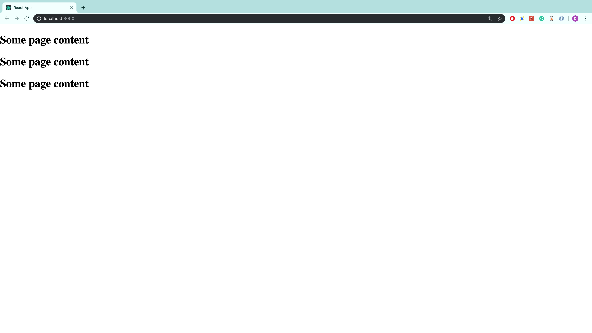
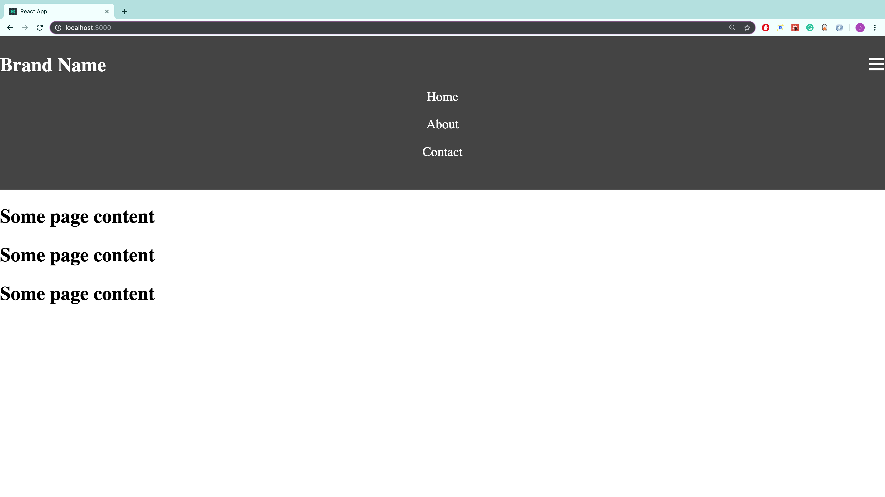
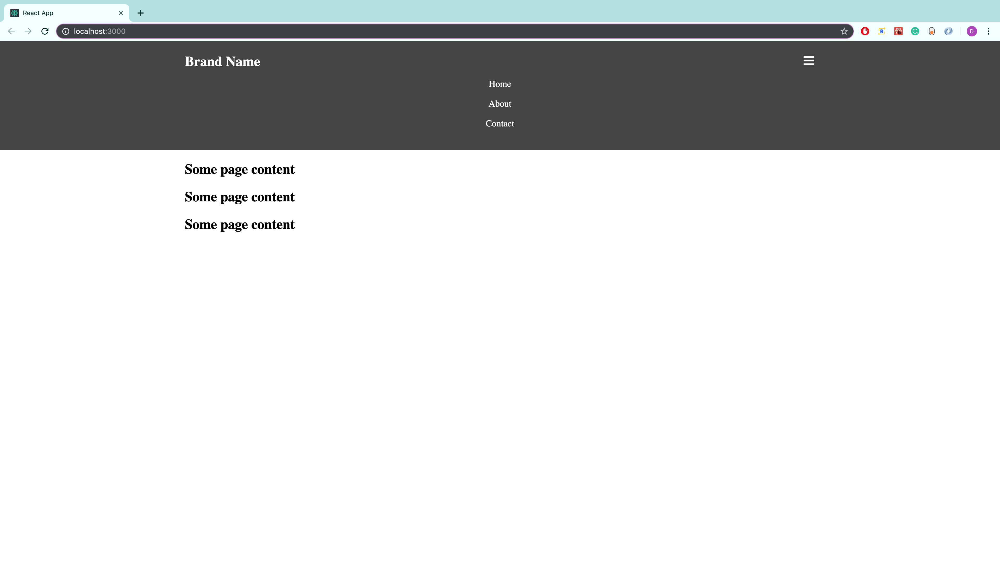

Navigation menus are a central part of every website. In this tutorial, we will be creating a responsive navbar in React.

**Prerequisites**: Basic knowledge in HTML, CSS, and React.

The demo and source code can be found at:

- [View Demo](https://domenicomanna.github.io/reactNavbar/)
- [View Source](https://github.com/domenicomanna/reactNavbar)

## Setup and Directory Structure

We will be using the [Create React App](https://reactjs.org/docs/create-a-new-react-app.html#create-react-app) boilerplate to get started.

```shell
npx create-react-app responsive-navbar
```

After that command executes, let's modify the structure of the created directory. In the src folder, let's create a components folder. Then, in the components folder, we'll create a layout folder. So our directory structure should now look like:

```
responsive-navbar/
  ...
  src/
    ...
    components/
      layout/
```

Even though we are just creating a navbar, it's still a good idea to keep the project organized, that way the navbar we are creating can be easily reused on different projects.

Finally, let's create a layout.js file in our layout folder, and add the following code to it:

```jsx title="layout/layout.js"
import React from 'react';

const Layout = (props) => {
  return <main> {props.children} </main>;
};

export default Layout;
```

Now, let's make sure everything is working correctly by returning this component in our app.js file.

```jsx title="App.js"
import React from 'react';
import Layout from './components/layout/layout';

function App() {
  return (
    <Layout>
      <h2>Some page content</h2>
      <h2>Some page content</h2>
      <h2>Some page content</h2>
    </Layout>
  );
}

export default App;
```

After running the development server, we should now see:



## Creating the Navbar Component

Now that everything is set up, let's begin creating the navbar component. In the layout folder, let's add a navbar.js file, and a navbar.module.css file. So, our layout directory now looks like:

```
layout
  navbar.js
  navbar.module.css
  layout.js
```

In the navbar.js file, add the following code:

```jsx title="layout/navbar.js"
import React from 'react';
import styles from './navbar.module.css';

const Navbar = (props) => {
  return (
    <header className={styles.header}>
      <nav className={styles.nav}>
        <h1 className={styles.brand}>Brand Name</h1>
        <ul className={styles.mainNavigationLinks}>
          <li className={styles.listLink}>
            <a className={styles.link} href="#">
              Home
            </a>
          </li>
          <li className={styles.listLink}>
            <a className={styles.link} href="#">
              About
            </a>
          </li>
          <li className={styles.listLink}>
            <a className={styles.link} href="#">
              Contact
            </a>
          </li>
        </ul>
        <span className={styles.hamburger}>&#9776; {/* HTML entity code for hamburger menu */}</span>
      </nav>
    </header>
  );
};

export default Navbar;
```

All we are doing here is creating the markup for a navigation menu. Now, let's add the styles in a mobile-first approach.

```css title="layout/navbar.module.css"
.header {
  background: #444;
  color: #fff;
  padding: 1.35rem 0;
}

.nav {
  position: relative;
}

.brand {
  margin: 0;
}

.mainNavigationLinks {
  padding: 0;
  margin: 1rem 0 0 0;
  list-style: none;
  text-align: center;
  display: block;
}

.link {
  display: inline-block;
  width: 100%;
  margin-bottom: 1rem;
  color: inherit;
  text-decoration: none;
}

.hamburger {
  position: absolute;
  top: -5px;
  right: 0px;
  font-size: 1.5rem;
  cursor: pointer;
}
```

One thing to note with the styling is that we set the position of the .nav class to relative, that way we can place the hamburger menu exactly where we would like it. In this case, our hamburger menu is given the class name .hamburger and will be positioned at the top right corner relative to the html element with the class name of .nav. Other than that, the styling is straightforward.

Finally, let's return the navbar component in our layout.js file.

```jsx title="layout.js"
import React from 'react';
import Navbar from './navbar';

const Layout = (props) => {
  return (
    <>
      <Navbar />
      <main> {props.children} </main>
    </>
  );
};

export default Layout;
```

So, at this point, our navigation menu should look like:



We are making progress, but we definitely need to make some improvements. For starters, we should prevent the content from hitting the sides of the viewport. Let's address that right now.

## Creating the Container Component

To ensure the page content does not hit the sides of the viewport, let's create a container component. We will do this by first creating a new folder called container inside the components folder. In the container folder let's add a container.js file, and a container.module.css file. So, the directory structure show now look like

```
components
  container
    container.js
    container.module.css
  layout
    ...
```

The code for the container component is super simple:

```jsx title="components/components.js"
import React from 'react';
import styles from './container.module.css';

const Container = (props) => {
  return <div className={styles.container}>{props.children}</div>;
};

export default Container;
```

And for the styling:

```css title="components/components.module.css"
.container {
  max-width: 1100px;
  margin: auto;
  padding: 0 1rem;
}
```

All we are doing here is wrapping the child elements in a div with a CSS class of container. This ensures that the child elements will never stretch beyond the defined width in our CSS class, which in this case is 1100px. In the case that the viewport is smaller than 1100px,
we also add padding on the left and right side of the container, which ensures that the page content will never hit the side edges of the viewport.

Now, let's put this container component to use. In our layout.js file let's add the highlighted lines of code:

```jsx title="layout.js"
import React from "react";
import Navbar from './navbar';
import Container from '../container/container'  {/* highlight-line */}

const Layout = (props) => {
  return (
    <>
      <Navbar />
      <Container> {/* highlight-line */}
        <main> {props.children} </main>
      </Container> {/* highlight-line */}
    </>
  )
}

export default Layout
```

Also, let's add the same three lines in our navbar.js file:

```jsx title="navbar.js"
import React from 'react';
import Container from '../container/container'; // highlight-line
import styles from './navbar.module.css';

const Navbar = (props) => {
  return (
    <header className={styles.header}>
      <Container>
        {' '}
        {/* highlight-line */}
        <nav className={styles.nav}>
          <h1 className={styles.brand}>Brand Name</h1>
          <ul className={styles.mainNavigationLinks}>
            <li className={styles.listLink}>
              <a className={styles.link} href="#">
                Home
              </a>
            </li>
            <li className={styles.listLink}>
              <a className={styles.link} href="#">
                About
              </a>
            </li>
            <li className={styles.listLink}>
              <a className={styles.link} href="#">
                Contact
              </a>
            </li>
          </ul>
          <span onClick={props.toggleHamburgerLinks} className={styles.hamburger}>
            &#9776; {/* HTML entity code for hamburger menu */}
          </span>
        </nav>
      </Container>{' '}
      {/* highlight-line */}
    </header>
  );
};

export default Navbar;
```

With these changes in place, our navigation menu should now look like:



This is much better, however, we still need to fix a few more issues. Right now, the hamburger menu is always open, which is not desirable. Let's add some code that will allow us to open and close the menu.

## Opening and Closing the Hamburger Menu

To open and close the hamburger menu, we will add state to our layout component. This state will keep track of when to show the hamburger links and when to hide them. To add state, let's convert the layout component to a class based component.

```jsx title="layout.js"
import React, { Component } from 'react';
import Navbar from './navbar';
import Container from '../container/container';

class Layout extends Component {
  state = {
    hamburgerLinksShouldShow: false,
  };

  render() {
    return (
      <>
        <Navbar />
        <main>
          <Container>{this.props.children}</Container>
        </main>
      </>
    );
  }
}

export default Layout;
```

Let's also add a method in this class that will change whether or not the hamburger links should show.

```js title="layout.js"
class Layout extends Component {
  state = {
    hamburgerLinksShouldShow: false,
  };

  toggleHamburgerLinks = () => {
    this.setState((previousState) => ({
      hamburgerLinksShouldShow: !previousState.hamburgerLinksShouldShow,
    }));
  };

  // ...
}
```

In this method, we are using the opposite value of the previous state to set the new state. So, if hamburgerLinksShouldShow was true, it will now be switched to false. In other words, if the hamburger menu is open, then the next time this method is called, the hamburger menu should close, and vice-versa.

Let's now pass down whether or not the hamburger links should show, and the toggle method as props to our navbar component. This will look like:

```jsx title="layout.js"
return (
  <>
    <Navbar
      hamburgerLinksShouldShow={this.state.hamburgerLinksShouldShow}
      toggleHamburgerLinks={this.toggleHamburgerLinks}
    />
    <main>
      <Container>{this.props.children}</Container>
    </main>
  </>
);
```

The full code should look like:

```jsx title="layout.js"
import React, { Component } from 'react';
import Navbar from './navbar';
import Container from '../container/container';

class Layout extends Component {
  state = {
    hamburgerLinksShouldShow: false,
  };

  toggleHamburgerLinks = () => {
    this.setState((previousState) => ({
      hamburgerLinksShouldShow: !previousState.hamburgerLinksShouldShow,
    }));
  };

  render() {
    return (
      <>
        <Navbar
          hamburgerLinksShouldShow={this.state.hamburgerLinksShouldShow}
          toggleHamburgerLinks={this.toggleHamburgerLinks}
        />
        <main>
          <Container>{this.props.children}</Container>
        </main>
      </>
    );
  }
}

export default Layout;
```

Now, let's use these props in our navbar component.

```jsx title="navbar.js"
const Navbar = props => {
  { /* highlight-range{1-4} */}
  let classesForMainNavigationLinks = [styles.mainNavigationLinks]
  if (props.hamburgerLinksShouldShow) {
    classesForMainNavigationLinks.push(styles.showHamburgerLinks)
  }

  return (
    <header className={styles.header}>
      <Container>
        <nav className={styles.nav}>
          <h1 className={styles.brand}>Brand Name</h1>
          <ul className={classesForMainNavigationLinks.join(" ")}> {/* highlight-line */}
            <li className={styles.listLink}>
              <a className={styles.link} href="#">
                Home
              </a>
            </li>
            <li className={styles.listLink}>
              <a className={styles.link} href="#">
                About
              </a>
            </li>
            <li className={styles.listLink}>
              <a className={styles.link} href="#">
                Contact
              </a>
            </li>
          </ul>
          <span
            onClick={props.toggleHamburgerLinks} {/* highlight-line */}
            className={styles.hamburger}
          >
            &#9776; {/* HTML entity code for hamburger menu */}
          </span>
        </nav>
      </Container>
    </header>
  )
}
```

Before I explain what's going on, let's add the following styles to our navbar stylesheet.

```css title="navbar.module.css"
.mainNavigationLinks {
  padding: 0;
  margin: 1rem 0 0 0;
  list-style: none;
  text-align: center;
  display: none; /* highlight-line */
}

/* highlight-range{1-3} */
.showHamburgerLinks {
  display: block;
}
```

So, now by default, our hamburger links will not show at all. When the hamburger menu is clicked, then our toggle method will be called, and the hamburgerLinksShouldShow value will be set to true. Since this is now true, our showHamburgerLinks CSS class will get added, and our hamburger menu will open.

## Improving the Styling For Large Screens

Great, so at this point we have a menu that will open and close, and is perfect for smaller devices. However, when the screen size is big enough, we should remove the hamburger menu altogether, and instead use a normal navigation bar. Let's work on that right now.

In our navbar stylesheet, let's add the following media query underneath all of the existing styles:

```css title="navbar.module.css"
@media (min-width: 500px) {
  .nav {
    display: flex;
    justify-content: space-between;
    align-items: center;
  }

  .brand {
    margin: 0;
  }

  .mainNavigationLinks {
    display: flex;
    margin: 0;
    height: auto;
  }

  .link {
    width: auto;
    margin-bottom: 0;
    border-radius: 5px;
    padding: 0.4rem 0.9rem;
    transition: color 0.3s;
  }

  @media (any-hover: hover) {
    .link:hover {
      color: #49c35d;
    }
  }

  .hamburger {
    display: none;
  }
}
```

So, the full code should look like:

```css title="navbar.module.css"
.header {
  background: #444;
  color: #fff;
  padding: 1.35rem 0;
}

.nav {
  position: relative;
}

.brand {
  margin: 0;
}

.mainNavigationLinks {
  padding: 0;
  margin: 1rem 0 0 0;
  list-style: none;
  text-align: center;
  display: none;
}

.showHamburgerLinks {
  display: block;
}

.link {
  display: inline-block;
  width: 100%;
  margin-bottom: 1rem;
  color: inherit;
  text-decoration: none;
}

.hamburger {
  position: absolute;
  top: -5px;
  right: 0px;
  font-size: 1.5rem;
  cursor: pointer;
}

@media (min-width: 500px) {
  .nav {
    display: flex;
    justify-content: space-between;
    align-items: center;
  }

  .brand {
    margin: 0;
  }

  .mainNavigationLinks {
    display: flex;
    margin: 0;
  }

  .link {
    width: auto;
    margin-bottom: 0;
    border-radius: 5px;
    padding: 0.4rem 0.9rem;
    transition: color 0.3s;
  }

  @media (any-hover: hover) {
    .link:hover {
      color: #49c35d;
    }
  }

  .hamburger {
    display: none;
  }
}
```

And with those styles added, the navbar now looks great on both smaller devices and larger devices!

## Adding Animation to the Hamburger Menu

The last modification we are going to make to our hamburger menu is to add animation to it. Currently, when we open and close it, the change is instant. Let's improve this so that it opens and closes smoothly.

We are going to use fixed height values in order to add this animation. In our navbar stylesheet, let's add the highlighted code:

```css title="navbar.module.css"
/* Other styles... */

.mainNavigationLinks {
  padding: 0;
  margin: 1rem 0 0 0;
  list-style: none;
  text-align: center;
  /* display: none; */
  /* highlight-range{1-3} */
  height: 0;
  overflow: hidden;
  transition: height 0.4s;
}

.showHamburgerLinks {
  /* display: block; */
  height: 114px; /* highlight-line */
}
@media (min-width: 500px) {
  .mainNavigationLinks {
    display: flex;
    margin: 0;
    height: auto; /* highlight-line */
  }

  /* Other styles... */
}
```

So, instead of going from display: none, to display: block, we go from a height of 0 to a height of 114px. Using these fixed heights allows us to add the transition property, which creates a smooth effect. The height of 114px was used because that was the original height of the element when it's display property was set to block. Chrome's Developer Tools were used to check this.

## Conclusion

Awesome, we created a navbar that can now be used on any React project! Here are the links again for the demo, and the source code.

- [View Demo](https://domenicomanna.github.io/reactNavbar/)
- [View Source](https://github.com/domenicomanna/reactNavbar)

Hopefully, this tutorial was useful to you, and thanks for reading!
